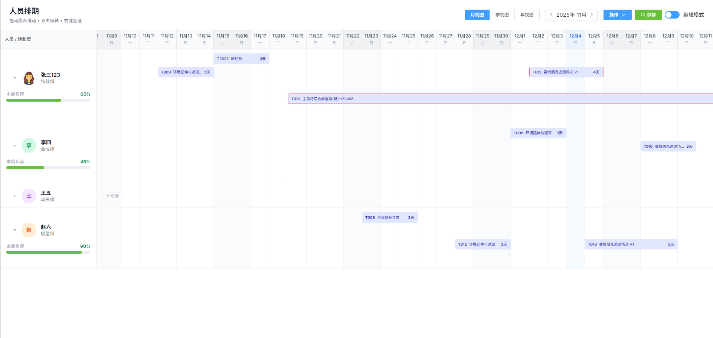

<div align="center">
  <h1>Resource Scheduler</h1>
  <p>一个基于 Vue 2.7 的可视化资源排期组件库</p>
  
</div>

## 介绍

本仓库同时包含：
- 示例应用：基于 Vite + Vue 2.7 的演示页面（结合 ElementUI 与自定义样式）。
- 组件库打包：输出 ESM 与 UMD 两种格式，并生成完整 TypeScript 类型声明。

你可以：
- 直接运行示例应用进行修改与体验；
- 作为组件库安装到你的项目中使用；
- 通过 CDN 在非打包环境快速集成。

## Gantt Scheduler 组件

- 组件名：`<gantt-scheduler>`
- 路径：访问 `http://localhost:3000/scheduler` 以查看演示页面

### Props

| 参数          | 类型      | 说明                                                       | 必填 |
| ------------- | --------- | ---------------------------------------------------------- | ---- |
| `readonly`    | `boolean` | 只读模式，禁用拖拽与编辑                                   | 否   |
| `task`        | `Staff[]` | 人员与任务数据数组（详见 `types.ts` 的 `Staff` 与 `Task`） | 是   |
| `title`       | `string`  | 标题文本（未提供 `#title` 插槽时显示）                     | 否   |
| `description` | `string`  | 描述文本（未提供 `#description` 插槽时显示）               | 否   |

### 事件

- `@data-change` 当图表内数据发生变更时触发，事件载荷为 `Staff[]`

### 插槽

| 插槽名         | 说明                                        |
| -------------- | ------------------------------------------- |
| `#title`       | 自定义标题区域                              |
| `#description` | 自定义描述区域                              |
| `#extra`       | 自定义按钮区域                              |
| `#avatar`      | 自定义头像区域（透传到每一行 `StaffRow`）   |
| `#workloadBar` | 自定义工作量展示（透传到每一行 `StaffRow`） |

### 使用示例（Vue 2.7）

```html
<template>
  <gantt-scheduler :readonly="false" :task="staffs" title="人员排期" description="支持拖拽与编辑">
    <template #avatar="{ staff }">
      
    </template>
  </gantt-scheduler>
</template>

<script>
import { GanttScheduler } from '@zcodery/resource-scheduler'
export default { components: { GanttScheduler } }
</script>
```

## 作为组件库使用（npm）

安装：

`npm install @zcodery/resource-scheduler`

导入：

`import { GanttScheduler } from '@zcodery/resource-scheduler'`

类型声明：自动随包提供，来自 `dist/types`。

对等依赖（peerDependencies）：
- `vue >= 2.7.0`

## 通过 CDN 使用

ESM：

`import { GanttScheduler } from 'https://cdn.jsdelivr.net/npm/@zcodery/resource-scheduler@0.1.1/dist/resource-scheduler.es.js'`

UMD（全局对象 `window.ResourceScheduler`）：

`<script src="https://cdn.jsdelivr.net/npm/@zcodery/resource-scheduler@0.1.1/dist/resource-scheduler.umd.js"></script>`

示例：

`const { GanttScheduler } = window.ResourceScheduler`

可选镜像：将上面 CDN 域名替换为 `unpkg.com` 亦可。

## 组件入口与导出

库入口文件：`index.ts`。
- 公共组件：`GanttScheduler`（稳定公共 API）
- 公共类型：`types.ts` 中的类型
- 公共常量：`constants.ts` 中的默认样式常量

## 导入限制与架构边界（重要）

- 外部项目仅应从包入口导入：`import { GanttScheduler } from '@zcodery/resource-scheduler'`。
- 禁止直接从 `components/*` 目录导入内部组件；这些为库内部实现细节，不保证跨版本稳定。
- CDN/UMD 使用时，仅访问 `window.ResourceScheduler.GanttScheduler`。
- 公共类型与常量可安全导入：`import { /* types, constants */ } from '@zcodery/resource-scheduler'`。

## 许可证

MIT

